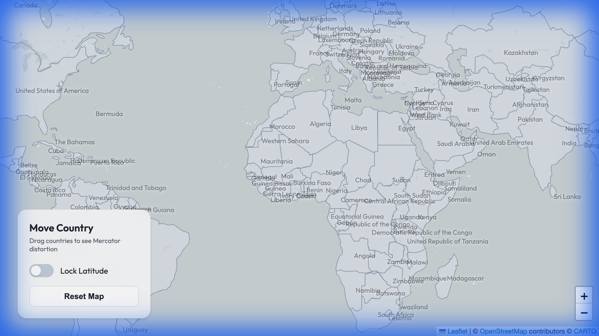

# World Map Country Mover

An interactive web application that allows you to drag countries across a world map to visualize the effects of the Mercator projection's distortion.

## 🚀 Live Demo

Check out the live application here: [https://benchenuk.github.io/sandbox.worldmapmover/](https://benchenuk.github.io/sandbox.worldmapmover/)

## 📸 Screenshot


*(Note: Visual representation of the interactive map and control panel)*

## ✨ Features

- **Interactive Drag & Drop**: Select and move any country to compare its size at different latitudes.
- **Mercator Scaling**: Watch countries dynamically resize to maintain their true geographical scale as you move them north or south.
- **Latitude Lock**: Toggle latitude locking to move countries strictly along their original horizontal axis.
- **Sleek UI**: A modern, glassmorphism-inspired control panel for a premium experience.
- **Reset Functionality**: Easy reset button to return the map to its initial state.

## 🛠️ Built With

- **Leaflet.js**: For interactive map rendering.
- **Vite**: Modern frontend tooling for rapid development and optimized builds.
- **Vanilla CSS**: Custom professional styling with a focus on responsiveness and aesthetics.
- **GeoJSON**: Precise country boundaries for accurate rendering.

## 🛠️ Local Development

1.  **Clone the repository**:
    ```bash
    git clone https://github.com/benchenuk/sandbox.worldmapmover.git
    cd sandbox.worldmapmover
    ```

2.  **Install dependencies**:
    ```bash
    npm install
    ```

3.  **Start the development server**:
    ```bash
    npm run dev
    ```

4.  **Build for production**:
    ```bash
    npm run build
    ```

## 📜 License

This project is licensed under the ISC License.
